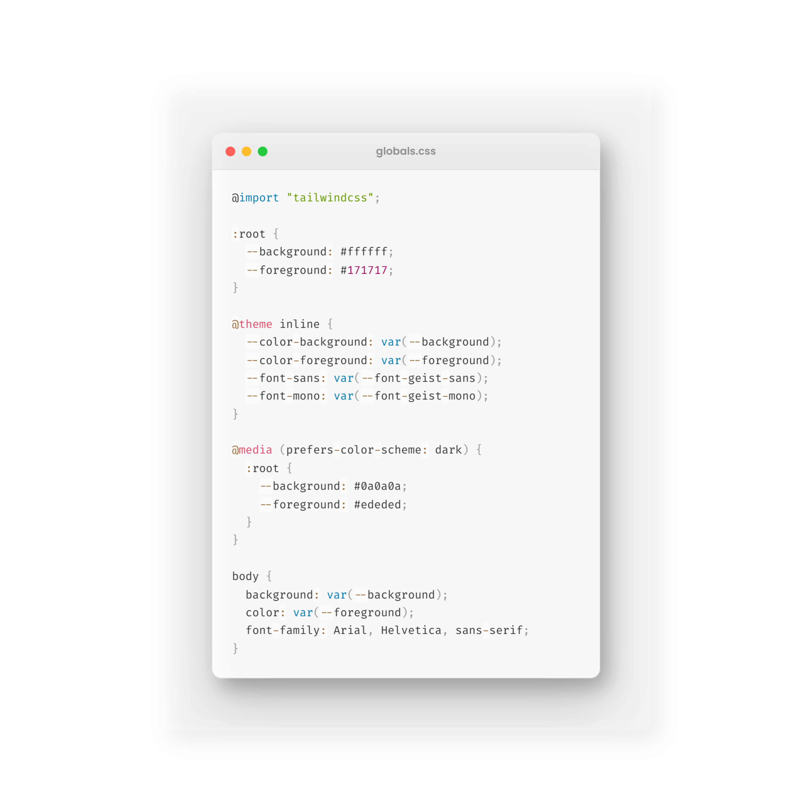

# ShareCode

**ShareCode** is a VS Code extension that allows you to take beautiful, high-quality snapshots of your code snippets instantly. Perfect for sharing on social media, documentation, or presentations.

## ✨ Features

- **Glassmorphism Design**: Beautiful, modern window frame with a glassmorphism effect.
- **Syntax Highlighting**: Built-in syntax highlighting using Prism.js.
- **Dynamic File Naming**: Automatically detects and displays the filename in the snapshot header.
- **High Resolution**: Captures snapshots using Puppeteer for crisp, high-quality images.
- **Easy to Use**: Simple command-based workflow to save snapshots directly to your machine.

## 📸 Preview

## 🚀 How to Use

1.  Open any file in VS Code.
2.  Select the code block you want to capture.
3.  Open the Command Palette (`Ctrl+Shift+P` or `Cmd+Shift+P`).
4.  Type and select **"ShareCode"**.
5.  Choose a location to save your `.png` file.
6.  Enjoy your beautiful code snapshot!

## 🛠️ Installation

1.  Search for **ShareCode** in the VS Code Marketplace (coming soon).
2.  Click **Install**.

*To run locally for development:*
1.  Clone this repository.
2.  Run `npm install`.
3.  Press `F5` to open a new VS Code Window with the extension enabled.

## 📦 Dependencies

- [Puppeteer](https://pptr.dev/): For rendering and capturing the code snapshot.
- [Prism.js](https://prismjs.com/): For high-quality syntax highlighting.

## 📝 License

This project is licensed under the MIT License.
